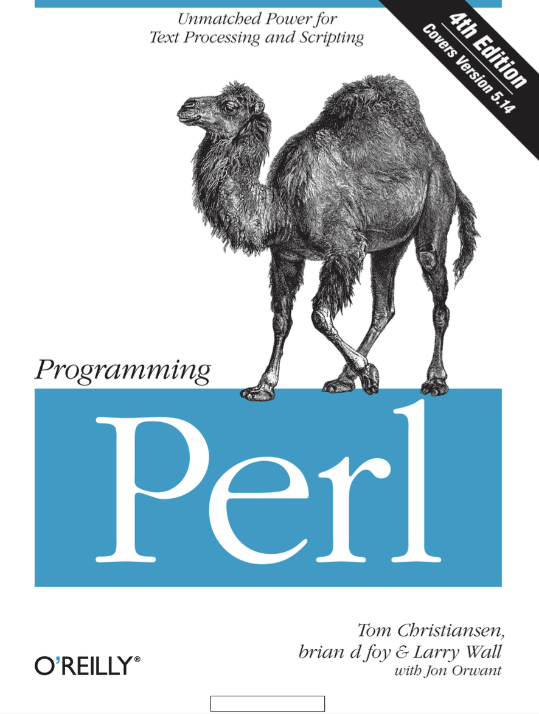
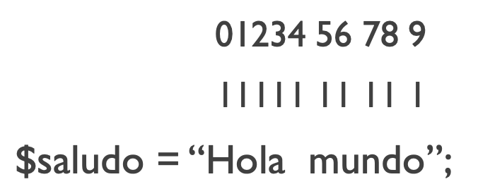

## Bibliografía

```{r,echo=FALSE,out.width='40%', fig.align='center'}

```


---
## Nuestro primer programa


- Todos los scripts de Perl deben terminar en .pl

- Todas las líneas dentro del script de Perl deben terminar con ;

- Para ejecutar el script escribe en tu consola perl programa_01.pl

--
<br>

Abre un archivo llamado programa_01.pl y agrega la siguiente línea

```{perl,eval=FALSE}
print "Este es mi primer programa!";
```

---

Quizá observes un símbolo % al final de la línea.

Debemos agregar el salto de línea al finalizar la frase

```{perl,eval=FALSE}
print "Este es mi primer programa!\n";
```

- \\n salto de línea/línea nueva
- \\t tabulador

---

```{r,echo=FALSE,out.width='45%',fig.align='center'}

```

---
<br>
Un ejemplo usando los operadores para generar letras mayúsculas y minúsculas
<br>
```{perl,eval=FALSE}
print "Este \ues \Umi \Lprimer \lPrograma!\n";
```

---

## Comillas dobles y sencillas

Las comillas sencillas muestran la forma literal de los caracteres

Las comillas dobles permiten actuar al operador de escape para agregar nueva línea o tabulador

```{perl,eval=FALSE}
print 'hola\n';
print "hola\n";
```

---

Aunque la terminación .pl indica que se trata de un script de Perl, es recomendable indicar al inicio del script el lenguaje.

```{perl,eval=FALSE}
#!/usr/bin/perl

print "Este es mi primer programa!\n";
```

---

### Ejercicio

¿Cómo escribirías el programa para que imprima lo siguiente?

```{r,echo=FALSE,fig.align='center'}

```

Escríbelo dentro de programa_02.pl 

---

Podemos usar comas (,) o puntos (.) para concatenar strings demasiado largos en print

```{perl, eval=FALSE}
print "Esta es una linea\nEsta es la \usegunda \Ulinea\tcon",
" \Etabulador\n\n\tUna linea \umás con dos \ttabuladores\n";

```

```{perl, eval=FALSE}
print "Esta es una linea\nEsta es la \usegunda \Ulinea\tcon" .
" \Etabulador\n\n\tUna linea \umás con dos \ttabuladores\n";

```
---

## Definiendo Variables en Perl

Existe diferentes tipos de variables en Perl:

- Escalares ($): Contiene un único valor (numérico, o caracter) 
- Arreglos (@) Contienen múltiples valores
- Hashes (#) Contienen un grupo de valores, asociados a un identificador
- Subrutinas (&) Secciones de código de Perl que pueden ser invocadas

---

En Perl, a diferencia de otros lenguajes, no se indica qué tipo de valor es (entero, numérico, carácter, etc.) sólo la complejidad de los datos.

Perl adapta el tipo de dato, dependiendo del contexto o la forma en que usemos el contenido de la variable

```{perl,eval=FALSE}
my $num = "123";
print $num + 1,"\n";
```

---

## Variables escalares

- Están definidas por un símbolo $

- Para definir propiamente a las variables usaremos _my_ al usarlas por primera vez, y el símbolo =

--

Escribe un archivo programa_03.pl y agrega esta línea:

```{perl,eval=FALSE}
my $frase = "Esta es mi primera variable\n";
```

---

En adelante, podremos hacer llamados a esta variable sin incluir _my_

```{perl,eval=FALSE}
my $frase = "Este es un escalar\n";
print $frase; 
```

--

Dentro de la función print también podemos agregar nuevas líneas o tabuladores

```{perl,eval=FALSE}
my $frase = "Este es un escalar";
print "$frase\n";
print "$frase\t$frase\n";
```

---

Si trabajamos con números, no es necesario escribirlos dentro de comillas.

```
my $num = 2000;
my $negnum = -2000;
```

---

## Buenas prácticas al nombrar variables

- Perl diferencia entre minúsculas y mayúsculas. VAR ≠ var ≠ Var
- Deben tener un prefijo $
- Después del prefijo debe ir siempre una letra, no un número. $x
- No puede tener símbolos, excepto _  ($variable_a) 
- No puede contener . ya que el punto representa concatenación en Perl.
- No puede tener espacios en blanco.
- Se recomienda que sean informativos.

---

### Ejercicio

Escribe un programa (programa_04.pl) que defina dos o más variables e imprímelas al mismo tiempo.

---

## Repetición del contenido de las variables

¿Cómo harías para imprimir 5 veces la palabra "hola"?

--

```{perl,eval=FALSE}
print "hola hola hola hola hola\n";
```

--
programa_05.pl

```{perl,eval=FALSE}
my $saludo = "hola " x 5;
print "$saludo\n";
```

---

### Ejercicio

Escribe un programa que imprima 4 filas con 5 repeticiones de "hola"

programa_06.pl

```{r,echo=FALSE,fig.align='center'}

```


---

## Variables especiales

Perl define algunas variables con propósitos especiales

- $_	Variable default.
- $0	Nombre del archivo que se está ejecutando actualmente.
- $]	Versión que se está usando de Perl.
- @_	Contiene los parámetros pasados a una subrutina.
- $ARGV	Contiene los argumentos dados al programa desde línea de comandos.
- < STDIN \>  Argumento dado al programa durante su ejecución.

---

## Operaciones artiméticas con variables

- $suma = $a + $b
- $resta = $a – $b 
- $multiplicacion = $a * $b
- $division = $a/$b
- $exponencial = $a ** $b
- $raiz_cuadrada = $a ** 0.5
- $residuo = $a % $b
- $autoincremento  = $a++
- $autodecremento = $a--

---

Las reglas aritméticas para operaciones funcionan de manera estándar en Perl

$a = 5; $b = 10; $c = 2;

¿ Cuál es el valor de $x ? 

$x = $a + $b / $c;

- Opción 1: Suma $a y $b y luego divide entre $c. $x = 7.5

$x = ($a + $b) / $c

- Opción 2: Divide $b entre $c y luego agrega $a. $x = $10 

$x = $a + ($b / $c)

---

## No confundir entre + y .

```{perl,eval=FALSE}
$a = 123;
$b = 456;
print $a + $b, "\n"; # imprime 579
print $a . $b, "\n"; # imprime 123456
```

--

## No confundir entre * y x

```{perl,eval=FALSE}
$a = 123;
$b = 3;
print $a * $b, "\n"; # imprime 369
print $a x $b, "\n"; # imprime 123123123
```

---

Se puede redefinir o sobreescribir una variable después de una operación.

programa_07.pl

```{perl,eval=FALSE}
$a = 5;
$b = 10;

print "$a\n";

$a = $a + $b;
print "$a\n";
```

---
## Existen formas reducidas de los operadores matemáticos

```{r,echo=FALSE, fig.align='center',out.width='70%'}

```

---

programa_08.pl

```{perl,eval=FALSE}
$a = 5;
$b = 10;

print "$a\n";

$a += $b;
print "$a\n";
```

---

## Operaciones lógicas con variables numéricas

- \> Mayor que
- \>= Mayor o igual que
- < Menor que
- <= Menor o igual que
- == Igual
- != Diferente

---

programa_09.pl

```{perl,eval=FALSE}
#!/usr/bin/perl

$a = 5; 
$b = 10; 
$c = 2;

my $comparacion = ($a < $b);
print "$comparacion\n";
```

¿Cómo se ve el resultado?

El resultado TRUE será representado con 1, ¿Cómo se verá el resultado FALSE?

---

## Operaciones lógicas con cadenas de caracteres

- eq Igual
- ne Diferente
- gt Mayor que
- lt Menor que
- ge Mayor o igual que
- le Menor o igual que

---

programa_10.pl

```{perl,eval=FALSE}
#!/usr/bin/perl

my $var1 = "uno"; 
my $var2 = "dos"; 
my $var3 = "tres";

my $comparacion1 = ($var1 eq $var2);
my $comparacion2 = ($var1 ne $var2);
my $comparacion3 = ($var1 ge $var3);

print "$comparacion1\t$comparacion2\t$comparacion3\n";
```

---
class: chapter-slide

# Algunos operadores con las variables escalares

---
### Operador length

Longitud de la cadena de caracteres

programa_11.pl

```{perl,eval=FALSE}
#!/usr/bin/perl

my $var1 = "uno"; 
my $var2 = "dos"; 
my $var3 = "tres";

my $longitud1 = length($var1);
my $longitud2 = length($var2);
my $longitud3 = length($var3);
```
---
```{perl,eval=FALSE}
print "La longitd de la variable 1 es ", $longitud1,
"\nLa longitd de la variable 2 es ", $longitud2,
"\nLa longitd de la variable 3 es ", $longitud3,"\n";
```

---

## Operador substr

Extrae elementos de una cadena, de acuerdo con su posición.

.center[substr( cadena,  posición_inicio,  longitud)]


En Perl, las posiciones comienzan en 0

```{r,echo=FALSE,out.width='60%',fig.align='center'}

```
---

Para extraer la palabra Hola

programa_12.pl
```{perl,eval=FALSE}
my $saludo = "Hola mundo";
my $hola = substr($saludo, 0, 4);
print "$hola\n";
```

---

### Ejercicio

¿Cómo extraerías la palabra mundo?

Escríbelo en programa_13.pl

--

Opción 1:

```{perl,eval=FALSE}
my $saludo = "Hola mundo";
my $mundo = substr($saludo, 5, 5);
print "$mundo\n";
```

---

## Otras formas de usar substr

.center[ 
substr( cadena,  posición_inicio) 

Si no indicamos la longitud, tomará lo que reste de la cadena
]

--

Opción 2:

```{perl,eval=FALSE}
my $saludo = "Hola mundo";
my $mundo = substr($saludo, 5);
print "$mundo\n";
```

---

## Otras formas de usar substr

.center[ 
substr( cadena,  -longitud)

A partir del final de la cadena, toma el número longitud de caracteres.

]

--

Opción 3:

```{perl,eval=FALSE}
my $saludo = "Hola planeta tierra";
my $tierra = substr($saludo, -6);
print "$tierra\n";
```

---

### Ejercicio

Extrae la sección indicada de las siguientes oraciones, utiliza las diferentes alternativas de substr


Yo no estimo _tesoros_ ni riquezas,

_y así,_ siempre me causa más contento

poner riquezas _en mi entendimiento_

que no mi entendimiento en las _riquezas._

programa_14.pl

---

## Operador split

.center[

split(/delimitador/, $variable)

Split divide una cadena de acuerdo a un delimitador
]

programa_15.pl

```{perl,eval=FALSE}
my $nombre_completo = "Juan Lopez Flores";
my ($nombre,$paterno,$materno) = split(/ /, $nombre_completo);
print "$nombre\n";
```

---

### Ejercicio

Separa las siguientes líneas e imprime la variable que contenga al valor numérico (programa_16.pl)

manzanas;5

mi cumpleaños es en \t100\t días

6,ardillas

