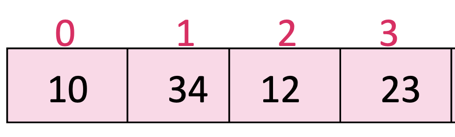

# Arreglos

- Lista ordenada de datos de tipo escalar. 

- Las variables de tipo array/arreglo se identifican por el prefijo arroba @.

- Para definirlos se usan paréntesis.

- Cada elemento se separa con una coma.

```{Perl, eval=FALSE}
my @numeros = (10,34,12,23);
my @palabras = ("uno","dos","tres");
```

---

# ¿Cómo imprimimos el contenido el arreglo?

programa_01.pl

```{Perl, eval=FALSE}
my @numeros = (10,34,12,23);
print "@numeros\n";

my @palabras = ("uno","dos","tres");
print(@palabras,"\n");
```

---

# ¿Cómo accedemos al contenido del arreglo?

- Cada elemento de la lista es una variable escalar a la que se le asocia con su posición, comenzando con cero. 

```{Perl, eval=FALSE}
@numeros = (10,34,12,23);
```

```{r,echo=FALSE,out.width='50%',fig.align='center'}

```

---

# Extracción de elementos del arreglo

Usando la posición del elemento

programa_02.pl

```{Perl, eval=FALSE}
my @numeros = (10,34,12,23);
print "$numeros[1]\n";

my @palabras = ("uno","dos","tres");
print($palabras[2],"\n");
```

---
# ¿Cuántos elementos tiene el arreglo?

```{Perl, eval=FALSE}
my @numeros = (10,34,12,23);
my $nElementos = @numeros;
```

# ¿Cuántas posiciones existen en el arreglo?

```{Perl, eval=FALSE}
my @palabras = ("uno","dos","tres");
my $nPosicion = $#palabras;

print "$nElementos\t$nPosicion\n";
```

---

class: chapter-slide

# Funciones asociadas a los arreglos

---

# Push

- Inserta un elemento al final del arreglo

programa_04.pl

```{Perl, eval=FALSE}
my @palabras = ("uno","dos","tres");
print "@palabras\n";

push(@palabras, "cuatro");
print  "@palabras\n"; 
```

---

# Pop

- Extrae el último elemento del arreglo

programa_05.pl

```{Perl, eval=FALSE}
my @palabras = ("uno","dos","tres");
print "@palabras\n";

my $elemento = pop(@palabras);

print  "$elemento\n@palabras\n"; 
```

---

# Ejercicio


Teniendo el arreglo:

```{Perl, eval=FALSE}
my @num = (1,2,3,4,5);
```

- Usando las estructuras de control, escribe un programa que agregue los números del 6 al 10 al arreglo.

- Imprime cómo quedó el arreglo 

- Ahora extrae e imprime los últimos dos elementos (números 10 y 9)

programa_06.pl

---

# shift

- Extrae el primer elemento del arreglo

programa_07.pl

```{Perl, eval=FALSE}
my @palabras = ("uno","dos","tres");
print "@palabras\n";

my $elemento = shift(@palabras);

print  "$elemento\n@palabras\n"; 
```

---

# unshift

- Inserta un elemento al inicio del arreglo

programa_08.pl

```{Perl, eval=FALSE}
my @palabras = ("uno","dos","tres");
print "@palabras\n";

unshift(@palabras, "cero");
print  "@palabras\n"; 
```

---

## Ejercicio

programa_09.pl

Teniendo el arreglo:

```{Perl, eval=FALSE}
my @num = (6,7,8,9,10);
```

- Usando estructuras de control y las funciones de arreglos, agrega al inicio del arreglo los números del 1 al 5

- Cómo se ve el arreglo final? Nota, que los números deben quedar en orden ascendente.

- Ahora extrae e imprime los primeros dos elementos (1 y 2)

---

# reverse

- Invierte el orden de los elementos del arreglo

programa_10.pl

```{Perl, eval=FALSE}
my @num = (1,2,3,4,5);
print "@num\n";

@num = reverse(@num);
print "@num\n";
```

---

# sort

- Ordena los elementos en orden ascendente

programa_11.pl

```{Perl, eval=FALSE}
my @num = (1,2,3,4,5);
print "@num\n";

@num = reverse(@num);
print "@num\n";

@num = sort(@num);
print "@num\n";
```

---

- Cuando se trata de caracteres, los ordena alfabéticamente

programa_11.pl

```{Perl, eval=FALSE}
my @palabras = ("uno", "dos", "tres");
print "@palabras\n";
@palabras = sort(@palabras);
print "@palabras\n";
```

---

## Ejercicio

programa_12.pl

Teniendo el arreglo:

```{Perl, eval=FALSE}
my @num = (1,6,4,5,9,2,7,3);
```

- Extrae los primeros 3 y los últimos 3 elementos del arreglo
- Guárdalos en un arreglo
- Imprime el arreglo ordenado de menor a mayor
- Imprime también el arreglo en orden descendente

---

# Usando la rutina explícita de sort

- Ordenar alfabéticamente de forma ascendente

```{Perl, eval=FALSE}
my @palabras = ("uno", "dos", "tres");
print "@palabras\n";

@palabras = sort{$a cmp $b}(@palabras);
print "@palabras\n";
```

--

- Ordenar alfabéticamente de forma descendente

```{Perl, eval=FALSE}
@palabras = sort{$b cmp $a}(@palabras);
print "@palabras\n";
```

---

- Ordenar numéricamente de forma ascendente

```{Perl, eval=FALSE}
my @num = (1,5,2,7);
print "@num\n";

@num = sort{$a <=> $b}(@num);
print "@num\n";
```

--

- Ordenar numéricamente de forma descendente

```{Perl, eval=FALSE}
@num = sort{$b <=> $a}(@num);
print "@num\n";
```

programa_13.pl

---

## Ejercicio

programa_14.pl

Modifica tu Ejercicio anterior y realiza el orden numérico ancendente y descendente usando la rutina explícita de sort

---

# Split

programa_15.pl

```{Perl, eval=FALSE}
my $frase = "Esta es una frase";
print "$frase\n";

my @palabras = split(/ /,$frase);

print "@palabras\n";
print "$palabras[3]\n";
```

---

## Ejercicio

programa_16.pl

- Escribe un programa que pida al usuario su nombre completo o una frase

- Separa cada elemento del nombre o la frase y guárdalo en un arreglo.

- Imprime cada elemento en líneas separadas.

---

# Join

- Une los elementos de un arreglo, dando como resultado una variable escalar.

programa_17.pl

```{Perl, eval=FALSE}
my $var_nums = "12345";
my @arreglo_num = split("",$var_nums);

my $numeros = join("-",@arreglo_num);
print "$numeros\n";
```

---

## Ejercicio

programa_18.pl

Modifica tu ejercicio anterior y une las palabraas de la frase o nombre del usuario, usando guión bajo.


