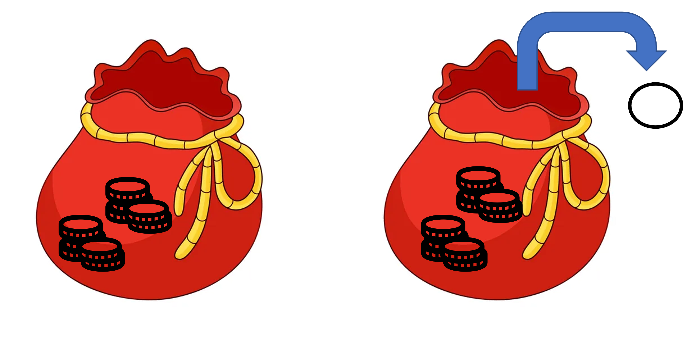

# ¿Qué son los hashes?

- Un tipo de arreglo en el que los elementos están ligados a una llave o identificador 

- Los elementos se identifican con un nombre compuesto de caracteres en lugar de una posición numérica.

- Dentro del hash los elementos se encuentran asociados como llave-valor

---
# Algunas características de los hashes

- Todos los hashes se identifican con el símbolo %

- Las llaves dentro del arreglo son únicas

- Los elementos dentro del hash no se encuentran ordenados

```{r, echo=FALSE, out.width='50%', fig.align='center'}

```

---
# ¿Cómo se genera un hash?


Opción 1:
- Usando una lista de elementos

- Cada par de elementos corresponderá a una asociación llave-valor

```{Perl,eval=FALSE}
my %hash = ("manzanas", 1, "fresas", 5, "moras", 25 );
```

programa_01.pl

---
Opción 2:

- Generando un hash vacío

- Definiendo cada valor correspondiente a la llave usando $hash{llave} = valor
```{Perl,eval=FALSE}
my %hash_vacio;

$hash_vacio{manzanas} = 1;
$hash_vacio{fresas} = 5;
$hash_vacio{moras} = 25;
```

programa_01.pl
---

Opción 3

Usando el operador =>

```{Perl,eval=FALSE}
my %frutas = (
        manzanas => 1,
        fresas => 5,
        moras => 25,
);
```

programa_01.pl

---
# ¿Cuántas llaves contiene el hash?

```{Perl,eval=FALSE}
my %hash = ("manzanas", 1, "fresas", 5, "moras", 25 );

my $nllaves = scalar(keys(%hash));
print "$nllaves\n";
```

programa_02.pl

---

# ¿Cuáles son las llaves del hash?

```{Perl,eval=FALSE}
my %hash = ("manzanas", 1, "fresas", 5, "moras", 25 );

my @llaves = keys(%hash);
print "@llaves\n";
```

programa_03.pl
---
# ¿Cómo extraemos el contenido de un hash?

- Un elemento 

```{Perl,eval=FALSE}
my %hash = ("manzanas", 1, "fresas", 5, "moras", 25 );

my $nfresas = $hash{fresas};
print("$nfresas\n");

print($hash{fresas},"\n");
```

programa_04.pl
---

- Todos los elementos

```{Perl,eval=FALSE}
my %hash = ("manzanas", 1, "fresas", 5, "moras", 25 );

my @llaves = keys(%hash);

foreach my $llave (@llaves) {
    print($hash{$llave}, "\n");
}

```
programa_05.pl

---
Para imprimir llave y valor:

```{Perl,eval=FALSE}
my %hash = ("manzanas", 1, "fresas", 5, "moras", 25 );

my @llaves = keys(%hash);

foreach my $llave (@llaves) {
    print("$llave\t", $hash{$llave}, "\n");
}
```

programa_06.pl

---

Opción sin definir el arreglo:

```{Perl,eval=FALSE}
my %hash = ("manzanas", 1, "fresas", 5, "moras", 25 );

foreach my $llave (keys(%hash)) {
    print("$llave\t",$hash{$llave}, "\n");
}
```

programa_07.pl
---

## Ejercicio

Usa los hashes que generamos en el programa_01.pl e imprime su contenido para comprobar que todos se generaron correctamente.

programa_08.pl
---

# Construyendo hashes a partir de un archivo

```{Perl,eval=FALSE}
my $archivo = "pinguinos.txt";
my $pinguino = $ARGV[0];

my %especies;
my $i = 1;

open(A, $archivo);

my $columnas = <A>;

```
---

```{Perl,eval=FALSE}
while(<A>) {
	chomp;
	my @arreglo = split(/\t/, $_);
	$especies{$i} = $arreglo[0];
	$i++;
}
close(A);


print "La especie del pinguino $pinguino es: 
$especies{$pinguino}\n";
```
programa_09.pl

---
## Ejercicio

- Genera un hash para saber cuál es la isla del pinguino x

- Si el pinguino x vive en la isla Dream, muestra también la especie del pinguino x. (Pista: la misma llave $i se puede usar en el hash especies y en el hash isla) 

programa_10.pl
---

# Hashes de arreglos

```{Perl,eval=FALSE}
my %hash = (
    canasta1 => ["manzanas", "moras", "mangos"],
    canasta2 => ["peras", "fresas"],
    canasta3 => ["mangos"],
);

foreach my $llave (keys(%hash)) {
	print("$hash{$llave}\n");
} 
```
programa_11.pl

---

```{Perl,eval=FALSE}
foreach my $llave (keys(%hash)) {
	for my $i (0 .. $#{ $hash{$llave} } ) {
		print "$hash{$llave}[$i] ";
	}
	print "\n";
	
} 

```

programa_11.pl

---
# Generando un hash de arreglos a partir de un archivo

```{Perl,eval=FALSE}
my $canasta = $ARGV[0];
my %frutas;

open(A, "frutas.txt");

while(<A>) {
        chomp;
        my @arreglo = split(/ /, $_);
        my $id = shift(@arreglo);
        $frutas{$id} = [@arreglo];
}
close(A);
```

---

```{Perl,eval=FALSE}
print "Las frutas de la canasta $canasta son: ";

for my $i (0 .. $#{$frutas{$canasta}}) {
        print "$frutas{$canasta}[$i] ";
}
print "\n";
```

programa_12.pl

---
## Ejercicio

- Genera un hash de arreglos con la tabla pinguinos.
- Imprime la isla en la que vive el pinguino x y las medidas de su pico.

programa_13.pl

---

# Arreglos de hashes

```{Perl,eval=FALSE}
my @frutas = (
    {   fruta => "manzanas",
        cantidad => 1, 
        color => "verde", 
    },
    {   fruta => "fresas",
        cantidad => 5, 
        color => "rojo", 
    },
    {   fruta => "moras",
        cantidad => 25, 
        color => "morado",
    },
);
```

---

```{Perl,eval=FALSE}
print "$frutas[1]{fruta}\n";
```

programa_14.pl

---

## Ejercicio

Modifica el programa anterior para que imprima la fruta 'x' y la característica 'y' a petición del usuario.

Pista: Usa ciclos y las posiciones del arreglo. Para conocer la última posición del arreglo se usa $#arreglo

programa_15.pl

---
# Generando el arreglo de hashes a partir de un archivo

```{Perl,eval=FALSE}
open(A, "frutas_para_hash.txt");
my @frutas;

while(<A>) { 
        chomp;
        my @arreglo = split(/ /,$_);
        my %hash;
        $hash{nombre} = $arreglo[0];
        $hash{cantidad} = $arreglo[1];
        $hash{color} = $arreglo[2];

        push(@frutas, {%hash} );
}
```

---
```{Perl,eval=FALSE}
close(A);

print "$frutas[1]{nombre}\n";
```

programa_16.pl

---

## Ejercicio 

- Genera un arreglo de hashes con la tabla pinguinos
- Extrae la información isla y alto de pico del pinguino 10
- Modifica el programa para que imprima la isla y alto de pico del pinguino x a petición del usuario

programa_17.pl

---

# Hashes de hashes

```{Perl,eval=FALSE}
my %frutas = (
    manzanas => {
        cantidad => 1, 
        color => "verde", 
    },
    fresas => {
        cantidad => 5, 
        color => "rojo", 
    },
    moras => {
        cantidad => 25, 
        color => "morado",
    },
);
```

---

```{Perl,eval=FALSE}
print "$frutas{moras}{color}\n";
```

programa_18.pl

---
# Creando hashes de hashes a partir de un archivo

```{Perl,eval=FALSE}
open(A, "frutas_para_hash.txt");
my %frutas;

while(<A>) {
	chomp;
	my @arreglo = split(/ /, $_);
		
	$frutas{$arreglo[0]}{cantidad} = $arreglo[1];
	$frutas{$arreglo[0]}{color} = $arreglo[2];
}
```
---
```{Perl,eval=FALSE}
close(A);

print "$frutas{moras}{color}\n";
```

programa_19.pl

---
## Ejercicio

- Genera un hash de hashes para la tabla pinguinos
- Extrae la información isla y alto de pico del pinguino 10
- Modifica el programa para que imprima la isla y alto de pico del pinguino x a petición del usuario

programa_20.pl

